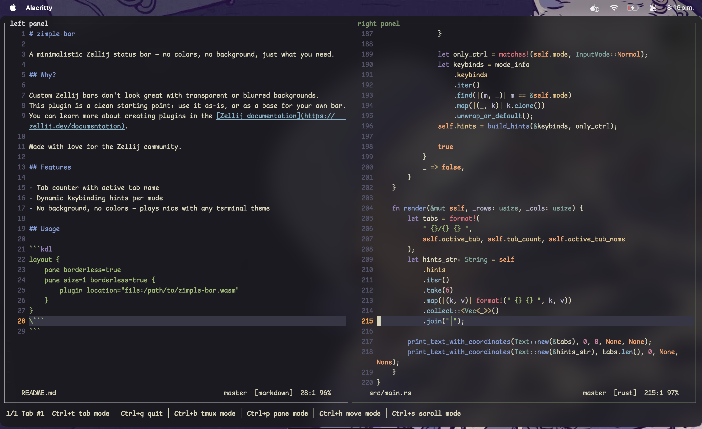

# zimple-bar

A minimalistic Zellij status bar — no colors, no background, just what you need.

## Why?

Custom Zellij bars don't look great with transparent or blurred backgrounds.
This plugin is a clean starting point: use it as-is, or as a base for your own bar.
You can learn more about creating plugins in the [Zellij documentation](https://zellij.dev/documentation).

Made with love for the Zellij community.



## Features

- Tab counter with active tab name
- Dynamic keybinding hints per mode
- No background, no colors — plays nice with any terminal theme

## Build

**Requirements:** Rust and the `wasm32-wasip1` target.

```bash
rustup target add wasm32-wasip1
```

**Compile and install:**

```bash
cargo build --release
cp target/wasm32-wasip1/release/zimple-bar.wasm ~/.local/share/zellij/plugins/zimple-bar.wasm
```

## Usage

```kdl
layout {
    pane borderless=true
    pane size=1 borderless=true {
        plugin location="file:~/.local/share/zellij/plugins/zimple-bar.wasm"
    }
}
\```
```
